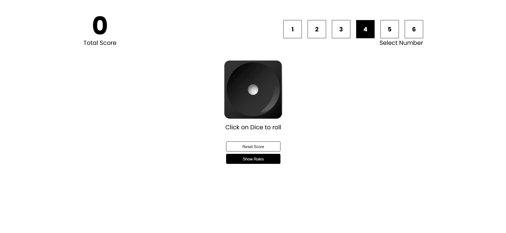
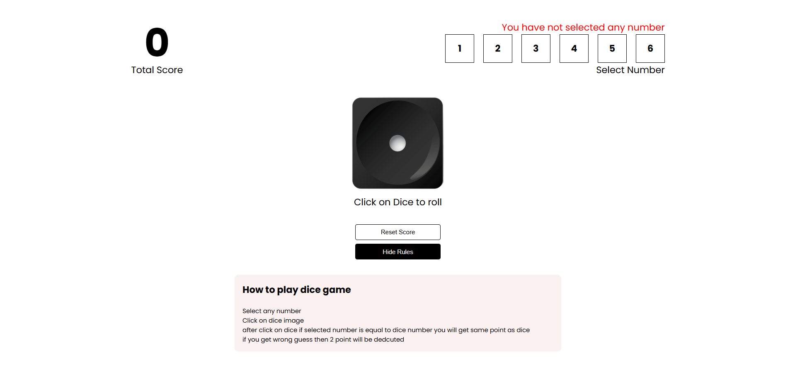

# 🎲 Dice Game – React Project

A simple interactive dice game built using **React + Vite**.

Players select a number and roll the dice.  
If the dice matches the selected number, points are awarded.  
Otherwise points are deducted.

---

## 🚀 Game Preview

### Start Screen

### Game Interface

### Game Rules

---

## 🎮 How To Play

1. Select any number between **1–6**
2. Click on the **dice** to roll
3. If your number matches the dice number  
   → You earn points
4. If it does not match  
   → **2 points will be deducted**